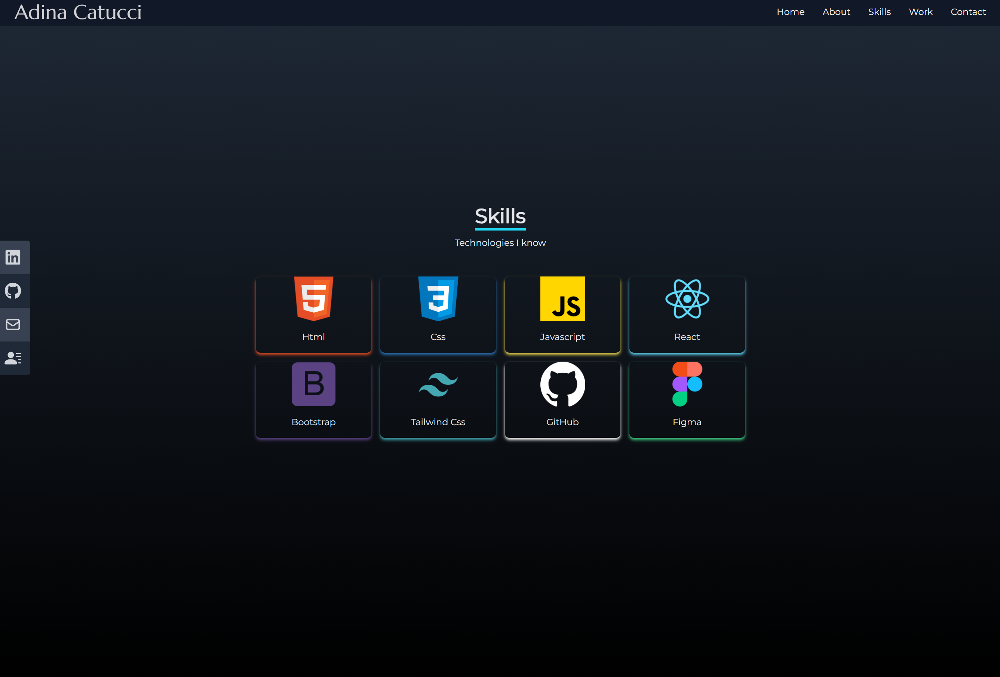

# 🎞️ Legacy Portfolio Website (React CRA)

A classic **Create React App**–based portfolio showcasing photography and design work.  
This repository is kept **in maintenance mode**: stable enough to run/build, not actively developed.



---

## 🌍 Live Demo
- Website: https://eleeira.github.io/main_portfolio_react/  
- Branch/hosting: GitHub Pages (build output → `build/`)

---

## 📦 Tech Stack
- **React 18** + **ReactDOM 18**
- **react-scripts 5.0.1** (Create React App)
- JavaScript (ES6+), HTML5, CSS3
- Optional libs: React Router, React Icons, etc.

---

## 🚀 Getting Started

> ✅ Works best with **Node 20 LTS**.  
> With Node 22+ you may need the OpenSSL flag (see “Known Issues”).

```bash
# install deps
npm install

# start dev server (http://localhost:3000)
npm start

# production build (outputs to ./build)
npm run build
```
---

## 🧩 Scripts
```bash
{
  "start": "react-scripts start",
  "build": "react-scripts build",
  "test": "react-scripts test",
  "eject": "react-scripts eject"
}
```

---

## 🗂️ Project Structure
```bash
/public        # static assets (favicon, index.html template, images)
/src
  /components  # UI components
  /assets      # images, fonts, styles (optional)
  index.js     # CRA entry point
  App.js       # root component
```

---

## ✨ Features
- Responsive gallery / minimal layout
- Clean, image-first presentation
- Simple contact links

---

## 🛠️ Development Notes (legacy/maintenance)
- Stable combo: react@18.3.1, react-dom@18.3.1, react-scripts@5.0.1
- Update browsers data periodically:
```bash
    npx browserslist@latest --update-db
```
- Keep dependencies lean; avoid major upgrades unless necessary.

---

## ⚠️ Known Issues & Quick Fixes
Node 22+ OpenSSL error

Some older toolchains need the legacy flag.
```bash
   # PowerShell (Windows)
$env:NODE_OPTIONS="--openssl-legacy-provider"
npm start

# for production build
$env:NODE_OPTIONS="--openssl-legacy-provider"
npm run build

```

---

## 🔍 Accessibility & SEO (light checklist)
- Alt text on images
- Sufficient color contrast
- Keyboard focus visible
- `<title>` + meta description per page
- OpenGraph image for sharing (in /public)

---

## 📬 Contact
- Email: adacatucci@proton.me
- LinkedIn: https://linkedin.com/in/adadigitalservices

---

📄 License
- This project is for personal portfolio use only.